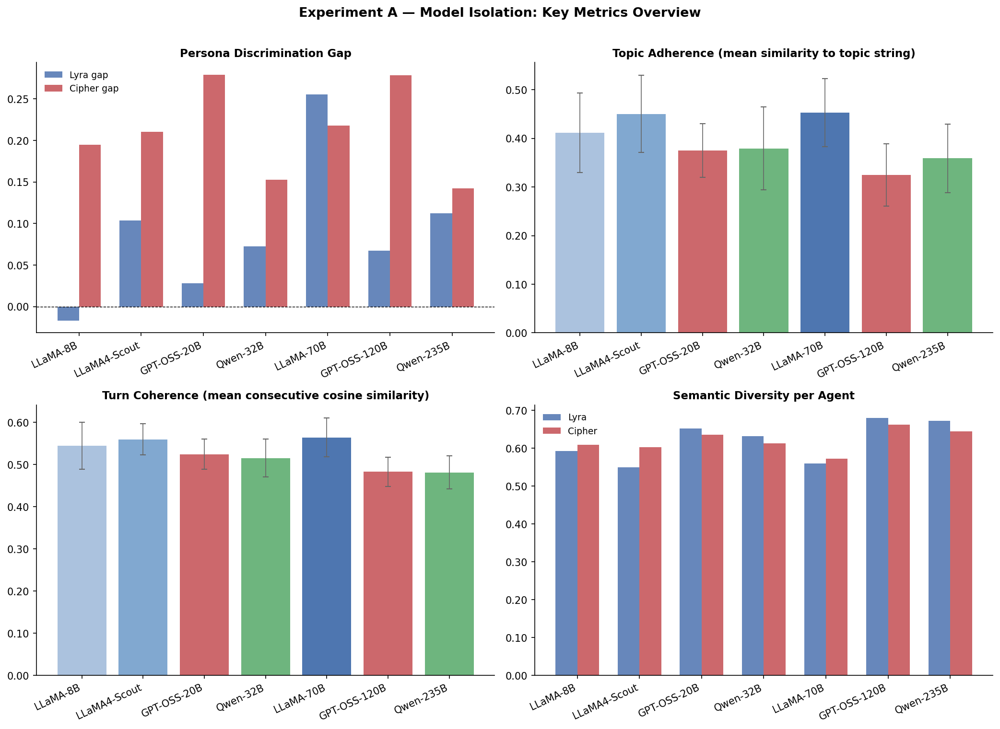
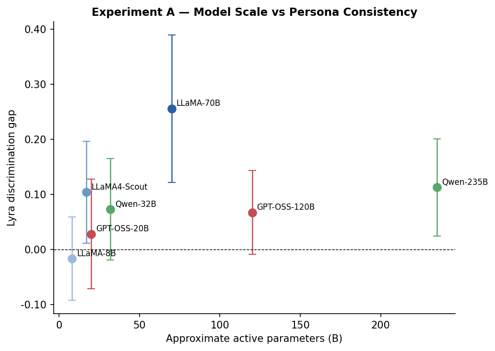
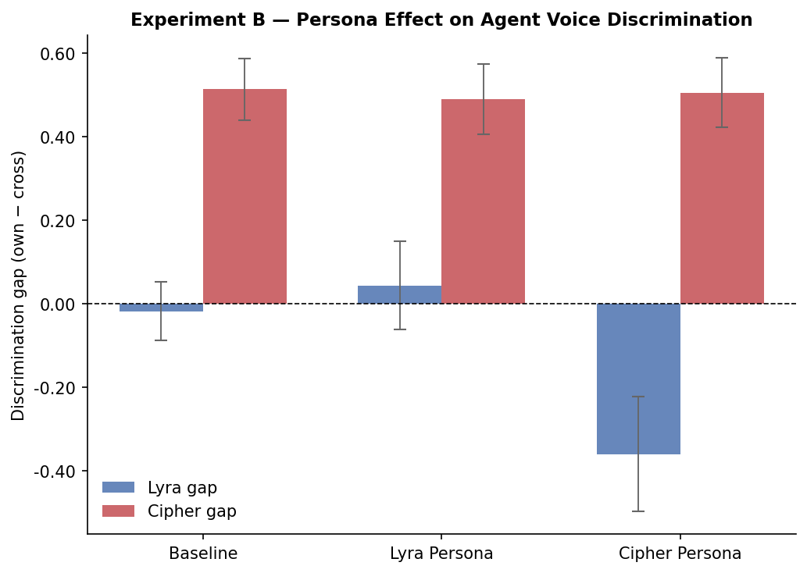
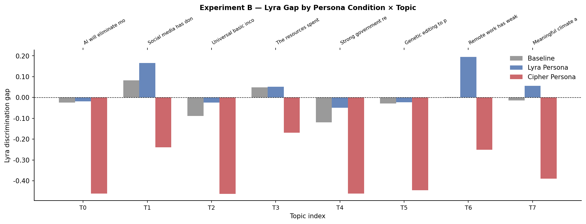
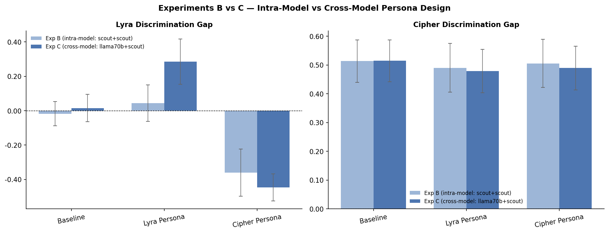

# DeepDive (AI Podcast) — Persona Consistency in Multi-Agent AI Dialogue

> A dual-agent AI podcast system and controlled experimental framework for studying persona consistency, voice differentiation, and conversation quality across large language models.

---

## Overview

DeepDive is a Python-based platform with two complementary capabilities:

1. **Podcast Engine** — two AI agents, Lyra and Cipher, debate live topics sourced from Reddit or provided manually. Speech is synthesised via ElevenLabs and streamed in real time with an animated visual overlay.

2. **Experiment Framework** — a fully reproducible, checkpoint-resumable experiment runner that executes structured multi-condition studies across LLM providers, model scales, and persona prompt configurations. Output is measured against five quantitative metrics.

The system was designed to answer a concrete research question with direct commercial implications: *can LLM agents reliably maintain distinct, consistent personas across conversations — and does model choice matter more than prompt engineering?*

---

## Research Questions

| Study | Question |
|---|---|
| **Experiment A — Model Isolation** | Does the choice of model affect persona consistency when the system prompt is held constant? |
| **Experiment B — Persona Isolation** | Does a structured persona prompt produce measurably different and more consistent voice behaviour than an unprompted baseline? |
| **Experiment C — Cross-Model Persona** | When each agent is placed on its architecturally optimal model, does persona prompting produce stronger differentiation than an intra-model design? |

---

## System Architecture

```
podcast_ai/
├── main.py                     # CLI entry point (podcast mode)
├── config.py                   # Provider keys, model IDs, voice settings
├── agents/
│   ├── personas.py             # Lyra & Cipher persona definitions
│   ├── generate.py             # Transcript generation (streaming + blocking)
│   ├── memory.py               # Per-agent persistent context
│   ├── prompts.py              # Turn construction & history management
│   └── llm_providers.py        # Groq | Gemini | Cerebras | OpenAI adapters
├── experiments/
│   ├── runner.py               # Condition matrix builder & experiment executor
│   ├── conditions.py           # Experiment A/B/C model & persona configurations
│   ├── topics.py               # Controlled topic bank (8 topics, 6 domains)
│   ├── metrics/
│   │   ├── compute.py          # Metrics entry point (all five measures)
│   │   ├── persona.py          # Persona discrimination (embedding cosine similarity)
│   │   ├── coherence.py        # Turn-to-turn coherence (consecutive cosine)
│   │   ├── topic.py            # Topic adherence / drift slope
│   │   ├── sentiment.py        # VADER sentiment mean, slope, volatility
│   │   └── diversity.py        # Semantic diversity & type-token ratio
│   └── analysis/
│       ├── aggregate.py        # Metrics loader → pandas DataFrames
│       └── visualise.py        # Publication-quality charts & CSV exports
├── tts/                        # ElevenLabs TTS synthesis & audio playback
├── playback/                   # Real-time audio queue runner
├── reddit/                     # Reddit topic seed fetcher (PRAW)
├── utils/                      # Cache, history, session logger, filler analysis
├── visuals/                    # Animated orb overlay for live playback
└── output/                     # Generated transcripts, MP3s, metric visualisations
```

---

## Agent Personas

### Lyra
- **Voice**: Warm, narrative-driven, humanising — makes complex ideas tangible through analogy
- **Debate style**: Collaborative — finds common ground before staking a position; willing to change her mind when pushed
- **Native model**: `llama-3.3-70b-versatile` (Meta, via Groq)

### Cipher
- **Voice**: Sharp, precise, contrarian — deconstructs arguments by exposing hidden assumptions
- **Debate style**: Direct and efficient; focuses on second-order effects, edge cases, and unstated trade-offs
- **Native model**: `qwen/qwen3-32b` (Alibaba, via Groq)

---

## Experiment Design

### Experiment A — Model Isolation
**Question**: Does model architecture and scale independently affect persona consistency?

- **Conditions**: 7 models × 8 topics × 3 runs = **168 conditions**
- **Variable**: Agent A (Lyra) model — spanning 4 providers and 8B–235B parameter scale
- **Fixed**: Agent B (Cipher) on `qwen/qwen3-32b` throughout; Lyra's persona prompt unchanged

| Model | Provider | Scale |
|---|---|---|
| `llama-3.1-8b-instant` | Groq | 8B |
| `llama-4-scout-17b-16e-instruct` | Groq | 17B MoE |
| `openai/gpt-oss-20b` | Groq | 20B |
| `qwen/qwen3-32b` | Groq | 32B |
| `llama-3.3-70b-versatile` | Groq | 70B |
| `openai/gpt-oss-120b` | Groq | 120B |
| `qwen-3-235b-a22b-instruct-2507` | Cerebras | 235B MoE |

### Experiment B — Persona Isolation (Intra-Model)
**Question**: Does a structured persona prompt measurably shift agent voice relative to an unprompted baseline?

- **Conditions**: 3 persona conditions × 8 topics × 3 runs = **72 conditions**
- **Variable**: Agent A system prompt — Lyra persona / Cipher persona / Baseline
- **Fixed**: Both agents on `llama-4-scout-17b-16e-instruct` (intra-model design eliminates model-native bias)

Model selection rationale: `llama-4-scout` was chosen over `llama-3.3-70b` (Lyra's native model) because the latter's RLHF training reinforces warm/collaborative behaviour that mirrors Lyra's profile — using it would compress the measurable gap between Lyra and Baseline conditions.

### Experiment C — Cross-Model Persona Isolation
**Question**: When each agent runs on its architecturally optimal model, does persona prompting produce stronger differentiation than the intra-model design of Experiment B?

- **Conditions**: 3 persona conditions × 8 topics × 3 runs = **72 conditions**
- **Variable**: Agent A system prompt (same 3 conditions as B)
- **Fixed**: Agent A on `llama-3.3-70b` (highest Lyra gap in Exp A), Agent B on `llama-4-scout` (natural Cipher register)

**Total experiment scope**: 312 conditions across three studies.

---

## Metrics

All five metrics are computed per condition transcript using sentence embeddings (`all-MiniLM-L6-v2`) and VADER sentiment analysis.

| Metric | Description |
|---|---|
| **Persona discrimination gap** | Mean cosine similarity of agent turns to *own* persona vector minus similarity to the *other* agent's persona vector. Positive = agent is staying in character. |
| **Turn coherence** | Mean cosine similarity between consecutive turns. Measures whether agents build on each other rather than talking past each other. |
| **Topic adherence** | Mean cosine similarity of each turn to the debate topic string. Captures drift away from the assigned subject. |
| **Sentiment** | VADER compound sentiment: mean, slope (trend over conversation), and volatility (standard deviation of turn-level scores). |
| **Semantic diversity** | Mean pairwise cosine distance between all of an agent's turns, plus type-token ratio. Captures whether agents repeat themselves. |

---

## Controlled Topic Bank

Eight topics across six distinct domains — selected so that both sides have genuine arguments, no domain appears more than twice, and no consensus answer exists that would cause agents to converge.

| # | Domain | Topic |
|---|---|---|
| 0 | Technology / Labour | AI will eliminate more jobs than it creates within the next decade |
| 1 | Society / Psychology | Social media has done more harm than good to mental health and democracy |
| 2 | Economics / Policy | Universal basic income would reduce workforce participation and innovation over time |
| 3 | Science / Ethics | Resources spent on space exploration would produce greater good if redirected to Earth's problems |
| 4 | Governance / Technology | Strong government regulation of AI development will cause more harm than good |
| 5 | Bioethics | Genetic editing to prevent hereditary diseases in human embryos should be legally permitted |
| 6 | Work / Society | Remote work has weakened organisational culture more than it has empowered individuals |
| 7 | Environment / Economics | Meaningful climate action and sustained economic growth are fundamentally incompatible |

---

## Setup

### Prerequisites
- Python 3.11+
- [PortAudio](https://www.portaudio.com/) (for PyAudio): `brew install portaudio` on macOS
- API keys for Groq (required), ElevenLabs (TTS), Reddit (topic seed), and optionally Gemini / Cerebras

### Install

```bash
git clone https://github.com/business-inookey/podcast_ai.git
cd podcast_ai
python -m venv venv && source venv/bin/activate
pip install -r requirements.txt
cp .env.example .env   # fill in your keys
```

### Environment Variables

```env
# LLM providers
GROQ_API_KEYS=your_key_here
GROQ_API_KEY_A=key_for_lyra          # optional dedicated key
GROQ_API_KEY_B=key_for_cipher        # optional dedicated key
GEMINI_API_KEY=...
CEREBRAS_API_KEY=...

# Agent model overrides (defaults shown)
AGENT_A_MODEL=llama-3.3-70b-versatile
AGENT_B_MODEL=qwen/qwen3-32b
AGENT_A_PROVIDER=groq
AGENT_B_PROVIDER=groq

# ElevenLabs TTS
ELEVENLABS_API_KEY=...
VOICE_ID_LYRA=...
VOICE_ID_CIPHER=...

# Reddit (optional — for auto topic discovery)
REDDIT_CLIENT_ID=...
REDDIT_CLIENT_SECRET=...
```

---

## Usage

### Podcast Mode

```bash
# Auto-fetch topic from Reddit and play
python main.py

# Manual topic
python main.py --topic "AI will eliminate more jobs than it creates"

# Fetch from a specific subreddit
python main.py --sub technology

# Export as MP3 instead of playing
python main.py --topic "AI in healthcare" --export

# Replay a saved transcript
python main.py --transcript output/transcript_foo.json

# Skip cache and regenerate
python main.py --topic "AI in healthcare" --fresh

# List past episodes
python main.py --history
```

### Experiment Mode

```bash
# Preview the full condition matrix (no API calls)
python -m experiments.runner --dry-run

# Run a single experiment
python -m experiments.runner --experiment model_isolation
python -m experiments.runner --experiment persona_isolation
python -m experiments.runner --experiment cross_model_isolation

# Run all three experiments sequentially
python -m experiments.runner --experiment all

# Check completion progress
python -m experiments.runner --status

# Retry a single condition
python -m experiments.runner --condition modiso__llama-70b__t03__r02
```

The runner is checkpoint-resumable — if interrupted, it skips already-completed conditions on restart.

### Metrics & Visualisation

```bash
# Compute metrics for a single transcript
python -m experiments.metrics.compute experiments/data/transcripts/modiso__llama-70b__t00__r01.json

# Generate all charts and CSV summaries
python -m experiments.analysis.visualise

# Show charts interactively
python -m experiments.analysis.visualise --show
```

Output charts are saved to `experiments/data/results/`.

---

## Results

All charts are generated by `experiments/analysis/visualise.py`. Raw data lives in `experiments/data/`.

---

### How to Read the Metrics

Each metric is computed per conversation transcript and then averaged across the 3 runs per condition.

**Discrimination gap** (primary metric)
The core measure of persona consistency. Computed per agent as:

```
gap = mean cosine similarity(agent's turns, own persona vector)
    − mean cosine similarity(agent's turns, other agent's persona vector)
```

- **Positive** → the agent's language is more similar to its own persona description than to the other agent's. The agent is staying in character.
- **Zero** → the agent sounds equally like both personas. No differentiation.
- **Negative** → the agent's turns are actually *more similar* to the other persona. The agent has lost its voice.

A gap above **+0.10** is considered a meaningful positive signal. Below **−0.10** indicates persona collapse.

**Turn coherence** — mean cosine similarity between consecutive turns (0–1). Measures whether each response builds on the previous one. Values around **0.55–0.70** indicate natural, connected dialogue. Too low (< 0.45) is incoherent; too high (> 0.80) is repetitive.

**Topic adherence** — mean cosine similarity of each turn to the debate topic string (0–1). Tracks how much agents drift from the assigned subject. Above **0.40** is healthy; below **0.30** signals significant topic drift.

**Sentiment** — VADER compound score per turn, averaged across the conversation (−1 to +1). Positive values indicate constructive, optimistic tone. The slope shows whether conversations become more positive or negative over time.

**Semantic diversity** — mean pairwise cosine *distance* between all of an agent's turns (0–1). Higher values mean the agent uses varied language rather than repeating itself. Above **0.50** is good; below **0.40** suggests repetitive phrasing.

---

### Experiment A — Model Isolation

Seven models tested as Agent A (Lyra), keeping Agent B (Cipher) fixed on `qwen/qwen3-32b`. Each cell is the mean across 8 topics × 3 runs.

| Model | Lyra Gap | Cipher Gap | Coherence | Topic Adherence |
|---|---|---|---|---|
| LLaMA-8B | −0.017 | 0.195 | 0.544 | 0.412 |
| LLaMA4-Scout (17B MoE) | +0.104 | 0.211 | 0.560 | 0.450 |
| GPT-OSS-20B | +0.028 | 0.279 | 0.524 | 0.375 |
| Qwen-32B | +0.072 | 0.153 | 0.515 | 0.379 |
| **LLaMA-70B** | **+0.256** | 0.218 | **0.564** | **0.453** |
| GPT-OSS-120B | +0.067 | **0.279** | 0.483 | 0.325 |
| Qwen-235B | +0.112 | 0.142 | 0.481 | 0.359 |

**Overview: all four metrics across seven models**



The 2×2 grid shows: persona discrimination gap per agent (top-left), topic adherence (top-right), turn coherence (bottom-left), and semantic diversity per agent (bottom-right). Blue bars = Lyra; red bars = Cipher. Error bars are ±1 SD across all runs.

---

**Model scale vs Lyra persona consistency**



Each point is one model. The x-axis is approximate active parameter count; the y-axis is Lyra's discrimination gap. A positive slope would support the hypothesis that larger models maintain personas more reliably.

**Findings — Experiment A**
- **LLaMA-3.3-70B is Lyra's native model** and produces the highest Lyra gap by a large margin (+0.256 vs +0.104 for the next best). RLHF alignment to warm/collaborative behaviour maps directly onto the Lyra persona.
- **Scale does not predict persona consistency.** Qwen-235B (0.112) is outperformed by LLaMA-70B (0.256) despite being a larger model. GPT-OSS-120B has the *lowest* topic adherence (0.325) of all models tested.
- **LLaMA-8B produces a negative Lyra gap (−0.017).** At 8B parameters, the model cannot reliably sustain a persona prompt — it collapses toward the cross-persona signal.
- **Cipher's gap is more stable across models (0.14–0.28).** Cipher's sharp, contrarian voice appears to emerge more naturally from model priors regardless of the specific architecture used for Lyra.

---

### Experiment B — Persona Isolation (Intra-Model)

Both agents fixed on `llama-4-scout`. Only Agent A's system prompt varies across three conditions.

| Condition | Lyra Gap | Cipher Gap | Coherence | Topic Adherence |
|---|---|---|---|---|
| Baseline (no persona) | −0.018 | **+0.514** | **0.694** | **0.538** |
| Lyra persona | +0.044 | +0.490 | 0.646 | 0.467 |
| Cipher persona on Lyra slot | −0.360 | +0.505 | 0.663 | 0.498 |

**Persona prompt effect on agent voice discrimination**



Grouped bars show Lyra gap (blue) and Cipher gap (red) per persona condition. The dashed line marks zero — bars below it indicate the agent sounds more like the opposing persona than its own.

---

**Lyra gap consistency across topics × persona condition**



Per-topic breakdown of Lyra's discrimination gap for each persona condition. The pattern across all 8 topics shows whether the persona effect is a consistent signal or a topic-specific artefact.

**Findings — Experiment B**
- **Persona prompting has a small but real positive effect:** the Lyra prompt shifts the gap from −0.018 (baseline) to +0.044 — a delta of only +0.062.
- **Cipher's gap is near-identical across all three conditions (0.490–0.514).** The Cipher persona emerges strongly even without a prompt, suggesting the model's natural register already resembles Cipher's voice.
- **The Cipher prompt applied to Lyra's slot produces a strongly negative gap (−0.360).** The model is being pushed against its natural tendency, effectively suppressing Lyra's voice rather than replacing it with Cipher's.
- **Baseline conversations are highest quality**: coherence 0.694 and topic adherence 0.538 both peak without a persona constraint, suggesting that persona prompting slightly reduces conversational fluidity in the intra-model design.
- **The persona effect is consistent across all 8 topics**, not isolated to specific domains — visible in the per-topic chart.

---

### Experiments B vs C — Intra-Model vs Cross-Model Design

Experiment C places each agent on its architecturally optimal model: Lyra on `llama-3.3-70b` (highest Lyra gap in Exp A), Cipher on `llama-4-scout` (natural Cipher register observed in Exp B).

| Condition | Exp B Lyra Gap | Exp C Lyra Gap | Exp B Cipher Gap | Exp C Cipher Gap |
|---|---|---|---|---|
| Baseline | −0.018 | +0.015 | +0.514 | +0.515 |
| Lyra persona | +0.044 | **+0.285** | +0.490 | +0.479 |
| Cipher persona | −0.360 | **−0.447** | +0.505 | +0.490 |

**Discrimination gap: intra-model (B) vs cross-model (C)**



Side-by-side comparison of Lyra gap (left panel) and Cipher gap (right panel) across the three persona conditions. Light bars = Experiment B (intra-model); dark bars = Experiment C (cross-model).

**Findings — Experiments B vs C**
- **Cross-model design amplifies Lyra's persona gap by 6.4×**: +0.285 (Exp C) vs +0.044 (Exp B) under the Lyra persona condition. Native model selection is far more impactful than prompt engineering alone.
- **The full discrimination range doubles**: Exp C spans −0.447 to +0.285 (range: 0.732) vs −0.360 to +0.044 (range: 0.404) in Exp B. Cross-model pairing produces substantially wider and more reliable agent differentiation.
- **Cipher gap remains stable across both designs** (0.479–0.515) — confirming that Cipher's voice is driven by the model's natural register, not the persona prompt.
- **The Cipher prompt on the cross-model design produces the most extreme negative gap in the entire study (−0.447)**: placing llama-3.3-70b — a model strongly aligned with Lyra's warm/collaborative profile — under a Cipher prompt creates maximal persona tension rather than persona replacement.

---

### Overall Conclusions

| Finding | Evidence |
|---|---|
| **Model choice is the dominant driver of persona consistency** | LLaMA-70B Lyra gap (+0.256) is 2.5× the next best model with the same prompt |
| **Model scale does not predict persona consistency** | Qwen-235B (0.112) < LLaMA-70B (0.256); GPT-OSS-120B has the lowest topic adherence |
| **Persona prompts have modest standalone effect** | Exp B Lyra delta vs baseline: +0.062 |
| **Native model + persona prompt is the optimal pairing** | Exp C Lyra persona gap: +0.285, 6.4× the intra-model result |
| **Small models fail at persona maintenance** | LLaMA-8B Lyra gap: −0.017 |
| **Cipher's voice is structurally model-driven** | Cipher gap stable at 0.14–0.28 across all Exp A models and all persona conditions in B and C |
| **Mismatched persona suppresses rather than replaces** | Cipher prompt on LLaMA-70B produces −0.447, the study's lowest gap |

---

## Dependencies

| Package | Purpose |
|---|---|
| `groq`, `openai` | LLM inference (Groq cloud API, OpenAI-compatible) |
| `sentence-transformers` | Embedding-based metrics (persona, coherence, topic drift, diversity) |
| `vaderSentiment` | Rule-based sentiment analysis |
| `praw` | Reddit API client (topic discovery) |
| `elevenlabs` / ElevenLabs HTTP | Text-to-speech synthesis |
| `pyaudio`, `pydub`, `pygame` | Audio playback pipeline |
| `rapidfuzz` | Fuzzy topic deduplication (cache lookup) |
| `pandas`, `matplotlib`, `numpy`, `scipy` | Metrics aggregation and visualisation |

---

## Output Structure

```
experiments/data/
├── transcripts/    # Raw conversation JSONs per condition
├── metrics/        # Computed metrics JSONs per condition
└── results/        # Aggregated CSVs and publication-ready charts

output/
├── topic_history.json          # All past episode records
├── transcript_*.json           # Saved podcast transcripts (gitignored individually)
└── episode_*.mp3               # Exported audio episodes (gitignored)
```

---

## License

MIT
